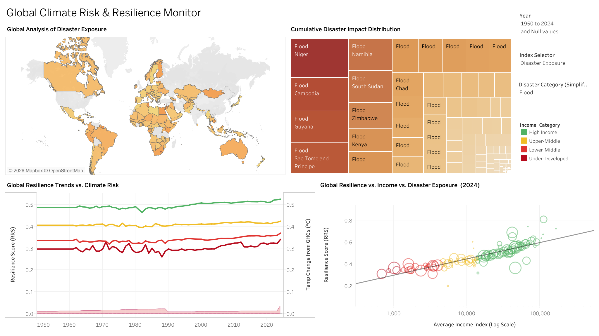

# 🌍 Global Climate Risk & Resilience Monitor

Dasboard can be viewed at: https://public.tableau.com/app/profile/ramalah.amir/viz/DAV_Project_DashBoard/DAV_project?publish=yes

> A data-driven analytical platform for quantifying and visualizing national disaster resilience — spanning 1900 to 2024 across 254 countries.



---

## 📌 Overview

Global disaster management remains predominantly **reactive**. Organizations like the Global Disaster and Humanitarian Response Agency (GDHRA) lack a unified, computational framework to measure *why* certain nations absorb shocks effectively while others face prolonged collapse.

This project addresses that gap by fusing multi-domain public datasets into a single analytical platform that quantifies resilience at national and regional scales — and surfaces actionable insights through an interactive Tableau dashboard.

---

## 🎯 Objectives

- **Data Fusion** — Harmonize 6 heterogeneous datasets (EM-DAT, World Bank, UNDP) into a unified 79,430-record country-year panel
- **Resilience Modeling** — Formulate and compute three custom indices: DII, RRS, and CRI
- **Feature Engineering** — Derive per-capita impact metrics, rolling disaster frequency, and adaptive capacity scores
- **Interactive Visualization** — Build an exploratory Tableau dashboard for decision-makers
- **Analytical Insight** — Determine the correlation between income, GDP, and disaster recovery

---

## 📂 Project Structure

```
├── data/
│   ├── raw/                        # Original source files
│   ├── merged_resilience_dataset.csv
│   ├── merged_resilience_dataset_cleaned.csv
│   ├── merged_resilience_dataset_with_features.csv
│   └── resilience_indices.csv
│
├── src/
│   ├── merge_datasets.py           # Data fusion pipeline
│   ├── FeatureEngr/
│   │   └── feature_engineering.py  # Index computation
│   └── config/
│       └── dataset_columns.json    # Column configuration
│
├── dashboard/                      # Tableau workbook files
├── DAV_project.png                 # Dashboard preview
└── README.md
```

---

## 🗃️ Data Sources

| Domain | Source | Period |
|---|---|---|
| Disaster History | [EM-DAT (CRED)](https://www.emdat.be/) | 1900–2024 |
| Climate / GHG | [Our World in Data](https://github.com/owid/co2-data) | 1900–2023 |
| Economic Indicators | [World Bank WDI](https://data.worldbank.org/) | 1900–2024 |
| Population | [World Bank WDI](https://data.worldbank.org/) | 1900–2024 |
| Human Development | [UNDP HDI](https://hdr.undp.org/data-center/human-development-index) | 1990–2023 |

---

## ⚙️ Methodology

### Resilience Indices

**1. Disaster Impact Index (DII)**
Measures disaster severity relative to a country's economic capacity.
$$DII = \left(\frac{F + A_{pop}}{GDP_{pc}}\right) \times S_w$$

**2. Resilience Recovery Score (RRS)**
Estimates recovery capacity by averaging economic rebound, human development, and adaptive capacity.
$$RRS = \frac{R_{rate} + HDI + A_{cap}}{3}$$

**3. Composite Resilience Index (CRI)**
Overall resilience — ratio of adaptive capacity to risk exposure.
$$CRI = \frac{A_{cap}}{E \times V}$$

### Preprocessing
- Missing disaster values imputed with `0` (non-occurrence assumption)
- Socio-economic gaps filled via **per-country linear interpolation**
- GDP growth outliers capped to `[-10, 10]` to handle hyperinflation anomalies
- All indices Min-Max scaled to `[0, 1]` for cross-country comparability

---

## 📊 Key Findings

- **North-South Resilience Divide** — High-income nations maintain CRI > 0.50 regardless of disaster exposure, while the Global South remains highly vulnerable even under moderate risk
- **The Adaptation Gap** — Since 1990, climate risk has escalated exponentially while under-developed nations have remained stagnant at RRS ≈ 0.30 for seven decades
- **Exposure Drag** — Wealth strongly predicts resilience, but extreme disaster frequency suppresses recovery below what income alone would predict
- **Disproportionate Burden** — Flood impacts are concentrated in low-income economies disproportionate to their GDP

---

## 🛠️ Tech Stack

- **Python** — `pandas`, `numpy`, `scikit-learn`, `openpyxl`
- **Tableau** — Interactive dashboard with choropleth maps, treemaps, scatter plots, and trend lines

---

## 🚀 Getting Started

### Prerequisites
```bash
pip install pandas numpy scikit-learn openpyxl
```

### Run the Pipeline
```bash
# Step 1: Merge all data sources
python src/merge_datasets.py

# Step 2: Engineer features and compute indices
python src/FeatureEngr/feature_engineering.py
```

Output files will be saved to the `data/` directory. Open the Tableau workbook to explore the dashboard.

---

## ⚠️ Limitations

- Reliable socio-economic data prior to 1990 is sparse for developing nations — linear interpolation may smooth over historical volatility
- Governance indicators (WGI) excluded due to availability only from 1996; Income Index used as proxy
- EM-DAT relies on self-reporting, which may under-represent smaller disasters in remote regions

---

## 👥 Authors

- **Ramalah Amir** — i232644@isb.nu.edu.pk
- **Shilok Kumar** — i232502@isb.nu.edu.pk

Department of Data Science, FAST NUCES Islamabad

---

## 📄 License

This project was developed for academic purposes as part of a Data Analytics & Visualization course.
